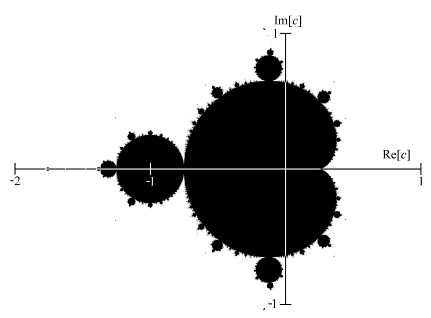

CUDA/pybind project structure adapted from https://github.com/pkestene/pybind11-cuda

<!DOCTYPE html>
<html lang="fr">
<head>
    <meta charset="UTF-8">
    <title>README</title>
    <style>
        .header {
            display: flex;
            justify-content: space-between;
            align-items: center;
        }
        .title {
            font-weight: bold;
            font-size: 24px;
        }
        .image {
            max-width: 300px;
            max-height: 300px;
        }
    </style>
</head>
<body>
    <div class="header">
        <div class="title">CUDA<br>Mandelbrot<br>acceleration</div>
        
    </div>
</body>
</html>

<br>

This project demonstrates various algorithms for computing the Mandelbrot set. The Mandelbrot set is a complex set of points that produces a fractal shape when plotted. It is defined by iterating the function:

```math
z_{n+1} = z_n^2 + c
```

where $c \in \mathbb{C}$ and $z_0 = 0$.

As $n$ approaches infinity, the magnitude of $z_n$ will either remain bounded or grow without bound. Starting points $c \in \mathbb{C}$ such that $(z_n)_n$ remain bounded are considered part of the Mandelbrot set, while points that escape to infinity are not.

<p align="center">
  
  <p align="center"><em>Figure 1: Mandelbrot set in the complex plane, in black.</em></p>
</p>

Since each pixel has to be computed individually, this problem is _embarrassingly parallel_.

## Algorithms

We have implemented various algorithms to compute the Mandelbrot set through a Python package called `mandelbrot_lib`and a C++/CUDA-based Python package called `cuda_mandelbrot_lib`. Some are common algorithms, and a few are our own.

```python
from mandelbrot_lib import NaiveSequential, NumpyGrid, NumbaCuda
from cuda_mandelbrot_lib import MultithreadCPP, BaseCUDA, ManualUnroll, PolynomialUnroll, PragmaUnroll
```

### 1. Naive Sequential (Python)

This is a straightforward implementation of the Mandelbrot set computation in Python. It iterates over each point in the grid and computes the number of iterations required for the point to escape.

All our implementations are subclasses of a common base class `_BaseAlgorithm`, and offer a similar interface, like the following:

```python
naive = NaiveSequential(escape_radius=escape_radius)
output = naive.compute_grid(xmin, ymin, xmax, ymax, width, height, n_iterations)
```

The output is a matrix of escape radii for each point in the grid.

### 2. Parallel Numpy (Python)

This implementation uses Numpy to parallelize the computation. By leveraging Numpy's vectorized operations, the algorithm can compute multiple points simultaneously, resulting in faster computation times.

```python
numpy = NumpyGrid(escape_radius=escape_radius)
```

### 3. Numba Python (GPU Python)

The Numba implementation utilizes the GPU to accelerate the computation. Numba is a just-in-time compiler for Python that translates Python functions to optimized machine code at runtime. This implementation uses the following configuration:

- Number of threads per block: 16x16 (256 threads).
- Number of blocks: Determined by the grid size divided by the number of threads per block.

```python
numba = NumbaCuda(escape_radius=escape_radius)
```

### 4. C++ Implementation

This is a C++ implementation of the Mandelbrot set computation. It provides a performance improvement over Python by using lower-level operations and optimizations available in C++. This implementation uses multithreading to parallelize the computation across multiple CPU cores.

```python
cpp = MultithreadCPP(escape_radius=escape_radius)
```

### 5. CUDA Implementation

The CUDA implementation leverages NVIDIA's CUDA platform to perform parallel computation on the GPU. CUDA allows for massive parallelism by using thousands of lightweight threads, each thread computing one pixel. This implementation uses:

- Number of threads per block: 16x16 (256 threads).
- Number of blocks: Determined by the grid size divided by the number of threads per block.

```python
cuda = BaseCUDA(escape_radius=escape_radius)
```

---

> The next three algorithms are our attemps at making a faster algorithm than the regular `MandelbrotCUDA` using general techniques and not Mandelbrot-specific micro-optimisations. For exemple, we could have manually defined certain areas of the complex plane we _know_ are or aren't in the set, and skip computation for these areas, but this is not the purpose of this analysis. We focused our attention on a technique that is more transferable to other problems: unrolling.

### 6. Unrolling

**Unrolling**

Let's consider a simple loop function

```python
def to_optimise():
    for i in range(3):
        do_something(i)
```

Under the hood, in most languages, it does the following:

```python
i = 0

do_something(i)
if i >= 3:  # evaluates to False
    break
i += 1

do_something(i)
if i >= 3:  # evaluates to False
    break
i += 1

do_something(i)
if i >= 3:  # evaluates to True
    break
```

If `do_something`is fast enough, all the checks and `i` incrementations can take a noticeable toll on performance. Now, consider the "unrolled" version:

```python
def unrolled():
    do_something(0)
    do_something(1)
    do_something(2)
```

This does significantly less work, for the same result.

**Unrolling Mandelbrot**

How can this be applied to the Mandelbrot set computation? Let's write the basic algorithm

```python
def escape_iteration(c, max_iter, escape_radius):
    z = 0 + 0j
    for iter_ in range(max_iter):
        z = z * z + c
        if norm(z) > escape_radius:
            return iter_
    return max_iter
```

A first idea that comes to mind is taking two-steps at each iteration. This "semi-unrolls" the loop:

```python
def escape_iteration_double(c, max_iter, escape_radius):
    z = 0 + 0j
    for iter_ in range(max_iter // 2):
        z = z * z + c
        z = z * z + c
        if norm(z) > escape_radius:
            return iter_ * 2
    return max_iter // 2
```

This eliminates half of the radius and #iterations checks, at the cost of sometimes overshooting the escape radius by one iteration. Indeed, this is doing iterations by batches of 2, but a point might only need an odd number of iterations to cross the escape radius.

The algorithm above is the basis for the `ManualUnroll` algorithm, even though it does it in the (x, y) plane and not the complex plane, as detailled below:

A single iteration of the Mandelbrot function is:

```math
z_{n+1} = z_n^2 + c
```

Expanding this using vector notation, we get:

```math
z_{n+1} = \begin{pmatrix} x \\\ y \end{pmatrix}^2 + \begin{pmatrix} a \\\ b \end{pmatrix}
```

Using multiplication rules for complex numbers,

```math
z_{n+1} = \begin{pmatrix} x^2 - y^2 \\\ 2xy \end{pmatrix} + \begin{pmatrix} a \\\ b \end{pmatrix}
```

```math
z_{n+1} = \begin{pmatrix} x^2 - y^2 + a \\\ 2xy + b \end{pmatrix}
```

Combining two iterations into one, we get:

$z_{n+2} = (z_{n+1})^2 + c = ((z_n^2 + c)^2 + c)$

Let

```math
\begin{pmatrix} x_1 \\\ y_1 \end{pmatrix} = \begin{pmatrix} x^2 - y^2 + a \\\ 2xy + b \end{pmatrix}
```

then:

```math
z_{n+2} = \begin{pmatrix} x_1 \\\ y_1 \end{pmatrix}^2 + \begin{pmatrix} a \\\ b \end{pmatrix}
```

```math
z_{n+2} = \begin{pmatrix} x_1^2 - y_1^2 \\\ 2x_1y_1 \end{pmatrix} + \begin{pmatrix} a \\\ b \end{pmatrix}
```

```math
z_{n+2} = \begin{pmatrix} x_1^2 - y_1^2 + a \\\ 2x_1y_1 + b \end{pmatrix}
```

---

Another idea is to expand this formula down to the most granular polynomial.

Expanding the terms, we get:

For the real part:
$\text{Real part} = (x^2 - y^2 + a)^2 - (2xy + b)^2 + a$
$= (x^2 - y^2 + a)(x^2 - y^2 + a) - (2xy + b)(2xy + b) + a$
$= x^4 - 2x^2y^2 + y^4 + 2ax^2 - 2ay^2 + a^2 - 4x^2y^2 - 4xyb - b^2 + a$
$= x^4 - 6x^2y^2 + y^4 + 2ax^2 - 2ay^2 + a^2 - 4xyb - b^2 + a$

For the imaginary part:
$\text{Imaginary part} = 2(x^2 - y^2 + a)(2xy + b) + b$
$= 2x^2 \cdot 2xy + 2x^2 \cdot b - 2y^2 \cdot 2xy - 2y^2 \cdot b + 2a \cdot 2xy + 2a \cdot b + b$
$= 4x^3y + 2x^2b - 4xy^3 - 2y^2b + 4axy + 2ab + b$

Therefore:

```math
z_{n+2} = \begin{pmatrix} x^4 - 6x^2y^2 + y^4 + 2ax^2 - 2ay^2 + a^2 - 4xyb - b^2 + a \\\ 4x^3y + 2x^2b - 4xy^3 - 2y^2b + 4axy + 2ab + b \end{pmatrix}
```

When computing this polynomial, we can re-use a lot of the factors.

```python
xy = x * y
x2 = x * x
y2 = y * y
x4 = x2 * x2
x2y2 = x2 * y2
y4 = y2 * y2
ax2 = a * x2
x3y = xy * x2
...
```

We named this algorithm `PolynomialUnroll`

---

Finally, we suspected that unrolling more than 2 operations can be beneficial in areas of the plane where a lot of iterations are needed to escape the radius, and is worth the occasional overhead of doing more iterations than needed. This is what is implemented in the `n_unroll.cu` script, which makes use of the `#pragma unroll` decorator to unroll the loops at compile time, for fixed unroll lengths in $[2, 3, 5, 10]$. The algorithm is called `PragmaUnroll` and implements `compute_grid_2`, `compute_grid_3`, `compute_grid_5` and `compute_grid_10` methods.

## Results

Below is a graph of the average execution time of each algorithm per grid size, in log-log scale.

<p align="center">
  
  <p align="center"><em>Figure 2: Time v.s. grid size.</em></p>
</p>

As we expect, all algorithms are asymptotically linear, but with different intercepts, and different behaviours for smaller grids.

Noticeably, all custom CUDA implementations beat the Numpy and Numba implementations by orders of magnitude, but are hard to tell apart.

Roughly, for large grids, in terms of speed,

$\text{CUDA implementations} > \text{Numba Python} > \text{Multithread C++} > \text{NumPy} > \text{Naive Python}$

A linear regression yields:

| Model             | Cells per µs |
| ----------------- | ------------ |
| NaiveSequential   | 0.01         |
| NumpyGrid         | 0.05         |
| MultithreadCPP    | 10.3         |
| NumbaCuda         | 132          |
| PolynomialUnroll  | 2580         |
| PragmaUnroll (2)  | 3340         |
| BaseCUDA          | 3520         |
| PragmaUnroll (5)  | 3770         |
| PragmaUnroll (10) | 3770         |
| PragmaUnroll (3)  | 3890         |
| ManualUnroll      | 4230         |

We'll run a separate analysis for the CUDA implementations below as a tie-breaker:

| Column            | Time (ms) for (10k, 10k) grid |
| ----------------- | ----------------------------- |
| PolynomialUnroll  | ${237.7} \pm {2.4} $          |
| BaseCUDA          | ${183.3} \pm {2.3} $          |
| PragmaUnroll (2)  | ${182.2} \pm {2.3} $          |
| PragmaUnroll (5)  | ${182.4} \pm {2.1} $          |
| PragmaUnroll (3)  | ${182.4} \pm {2.3} $          |
| PragmaUnroll (10) | ${182.0} \pm {2.0} $          |
| ManualUnroll      | ${176.0} \pm {2.5} $          |

In the end, our **`ManualUnroll` is statistically significantly faster than the CUDA benchmark `BaseCUDA`** (Z-statistic = 2.95, p-value = 0.0016), and than every other algorithm we tried.

All `PragmaUnroll` algorithms slightly beat the benchmark, but not very significantly. The `PolynomialUnroll` is the worse of all CUDA implementations, which is not surprising given the fact that a lot of intermediary terms have to be computed and stored.
